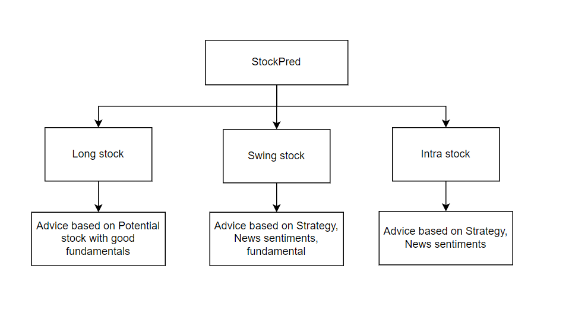

# IQInvest: Long-Term Investment Platform

<<<<<<< Updated upstream
IQInvest is an all-in-one investment advisory platform designed recommends stocks for long-term, short-term, and intraday investments, providing entry points, target prices, and stop-loss levels.It leverages stock fundamentals, news sentiment analysis, and effective trading strategies to make informed recommendations.

## Project Flow Diagram


=======
IQInvest is an all-in-one investment advisory platform designed to support day trading, swing trading, and long-term investments.
>>>>>>> Stashed changes

## Project Structure

````
<<<<<<< Updated upstream
````
=======
>>>>>>> Stashed changes
IQInvest/
├── app/
│   ├── main.py            # API initialization and routing
│   ├── models.py          # Database models (SQLAlchemy)
│   ├── crud.py            # CRUD operations
│   ├── schemas.py         # Pydantic schemas for request/response validation
│   └── ml_models.py       # ML/statistical model functions (e.g., portfolio optimization)
├── config.py              # Configuration settings (database, API keys, etc.)
├── requirements.txt       # List of dependencies
└── Dockerfile             # Container setup for deployment
````
<<<<<<< Updated upstream
````
=======
>>>>>>> Stashed changes

## Quick Start

### Prerequisites

- **Python 3.8+**
- **FastAPI**: A lightweight, asynchronous web framework.
- **PostgreSQL**: A relational database for persistent data storage.
- **Docker** (optional): For containerization and deployment.

### Installation

1. **Clone the Repository**

```bash
git clone https://github.com/yourusername/IQInvest.git
cd IQInvest
```
<<<<<<< Updated upstream

```bash
git clone https://github.com/yourusername/IQInvest.git
cd IQInvest
```
=======
>>>>>>> Stashed changes

2. **Install Dependencies**

```bash
pip install -r requirements.txt
```
<<<<<<< Updated upstream

```bash
pip install -r requirements.txt
```

3. **Database Setup**


=======

3. **Database Setup**

>>>>>>> Stashed changes
   - Configure PostgreSQL and define tables in `models.py` (e.g., `User`, `Portfolio`, `Assets`, `Recommendations`).

4. **Run FastAPI**

```bash
uvicorn app.main:app --reload
```
<<<<<<< Updated upstream

```bash
uvicorn app.main:app --reload
```
=======
>>>>>>> Stashed changes

### Run with Docker

```bash
docker build -t iqinvest .
docker run -p 8000:8000 iqinvest
```

## License

[MIT License](LICENSE)

